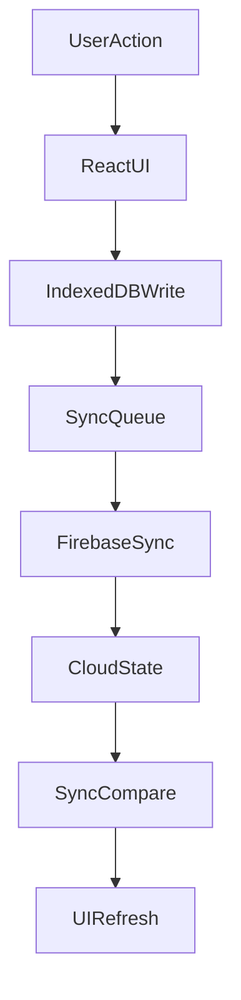

# Architecture Overview

## High-Level Design

LifeRoadmap is an offline-first task system:

- local data lives in IndexedDB (`src/db.ts`)
- cloud sync uses Firebase (`src/firebase/**`)
- UI reconstructs task tree from flat nodes (`parentId`)
- conflict handling is done by sync comparison utilities

## Data Model

Primary entity: `Node` (`src/types.ts`).

Key points:

- persisted in flat form (`id`, `parentId`)
- tree is rebuilt in memory for rendering/navigation
- optional scheduling fields are carried through local + cloud + compare paths

## Main Modules

- `src/pages/NodePage.tsx` - top-level orchestration
- `src/components/**` - UI widgets, lists, modals
- `src/db.ts` - IndexedDB read/write and tree reconstruction
- `src/firebase/sync.ts` - Firestore sync and normalization
- `src/utils/syncCompare.ts` - conflict significance checks
- `src/utils/recurrence.ts` - schedule slot expansion for week view
- `src/i18n.ts` - UI localization strings

## Runtime Flow

## Sync and Safety Invariants

- Backward compatibility matters when extending `Node`.
- Any model field change must be propagated through:
  - `src/types.ts`
  - `src/db.ts`
  - `src/firebase/sync.ts`
  - `src/utils/syncCompare.ts`
- Do not weaken encryption/key-management behavior in security modules.

## Where to Start for Sensitive Changes

1. `AGENTS.md`
2. `src/types.ts`
3. `src/db.ts`
4. `src/firebase/sync.ts`
5. `src/utils/syncCompare.ts`
